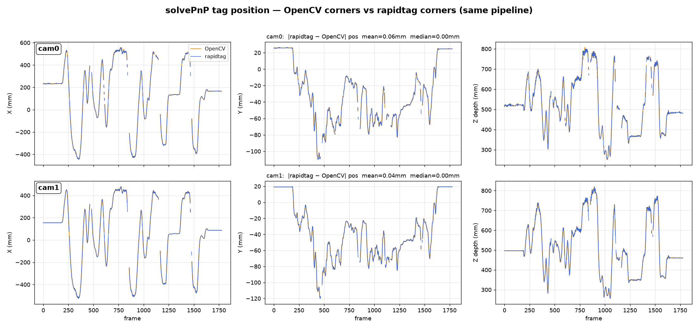

# RapidTag

> ⚠️ **Work in progress — not production-ready.** RapidTag is under active development
> and pre-1.0. APIs, behavior, and results may change without notice. Use it for research,
> evaluation, and prototyping, and validate it against your own data before relying on it
> for anything critical.

**Fast, pure-Rust fiducial marker detection for realtime.** RapidTag is a from-scratch
Rust reimplementation of OpenCV's ArUco / AprilTag marker detector, exposed to Python via
[maturin](https://www.maturin.rs/) / [PyO3](https://pyo3.rs/) — with **no OpenCV runtime
dependency**. It reproduces OpenCV's detections down to the pixel while running
substantially faster.

## Why RapidTag

- ⚡ **Faster than OpenCV** — **~1.6× faster** for realtime single-camera detection, and
  **up to ~3.4× faster** for multi-camera and offline batches (scales across cores).
- 🎯 **A true drop-in for accuracy** — corners match OpenCV to **0.0000 px**, so any
  downstream pose or tracking is identical (see below).
- 🧵 **Scales with your cores** — a batch API processes many frames (a stereo pair, or a
  whole recording) across all cores with the GIL released.
- 📦 **No OpenCV needed at runtime** — the detection pipeline and marker dictionaries are
  implemented in pure Rust on top of `image` / `nalgebra`.

## Performance

Measured on real dual-camera data (1280×800 monochrome, AprilTag 36h11):

| Workload | Speed vs OpenCV |
|----------|:---------------:|
| Realtime, single camera | **1.57× faster** |
| Multi-camera / offline batch (all cores) | **up to ~3.4× faster** |

Same detections, less time — the speedup comes from a leaner detection pipeline, not from
skipping work.

### Heterogeneous (big.LITTLE) ARM CPUs

On big.LITTLE SoCs, RapidTag pins its worker pool to the fast cores automatically.
Every detect call waits on its slowest parallel task, so letting the OS place even one
task on a little core caps the whole batch at little-core speed — on a Radxa Dragon Q6A
(QCS6490: 4× A55 @1.9 GHz + 4× A78 @2.4–2.7 GHz) auto-pinning takes a single
1280×800 detect from 68 fps to 211 fps, and a dual-camera pair from 66 to 134 pairs/s.
The calling thread and any capture/IO threads are left unpinned, keeping the little
cores for them. Homogeneous CPUs and non-Linux hosts are unaffected.

Override with `RAPIDTAG_CORES`: an explicit core list (`4-7`, `0,2,4`) or `all` to
disable pinning. `RAYON_NUM_THREADS` still controls pool size when set.

Two further board-level settings are worth it on embedded targets:

* build for the exact CPU with `scripts/build-board.sh` (`-C target-cpu=native`)
* switch the fast cores' cpufreq governor to `performance` — bursty per-frame work
  never keeps `schedutil` clocked up (on the Q6A this is another ~1.7×:
  123 → 211 fps single, 102 → 134 pairs/s dual)

## Accuracy — verified as a drop-in replacement

Because RapidTag's corners are pixel-identical to OpenCV's, feeding them into the exact
same pose pipeline (`cv2.solvePnP`) yields the **same trajectory**. Across a ~1,700-frame
stereo recording of a moving AprilTag, the recovered position from RapidTag vs OpenCV
corners is indistinguishable — a **median difference of 0.00 mm** on both cameras.



## Install

```bash
pip install rapidtag
```

Prebuilt wheels are published for:

| OS | Architectures | libc |
|----|---------------|------|
| Linux | x86_64, **aarch64 (arm64)** | glibc (manylinux) + musl (Alpine) |
| macOS | x86_64 (Intel), **arm64 (Apple Silicon)** | — |
| Windows | x64 | — |

Wheels are `abi3` (one wheel works on CPython 3.9+). If no wheel matches, `pip` builds from
the source distribution (needs a Rust toolchain).

## Usage

```python
import cv2            # only to load/generate images
import rapidtag

img = cv2.imread("scene.png")          # HxWx3 BGR, or HxW grayscale uint8

# --- realtime: one frame ---
corners, ids = rapidtag.detect_markers(img, "DICT_APRILTAG_36h11")
# corners: list of 4x2 [(x, y), ...] per marker (clockwise)
# ids:     list of marker ids, aligned with corners

# --- multi-camera / batch: process many frames across all cores ---
results = rapidtag.detect_markers_batch([cam0, cam1], "DICT_APRILTAG_36h11")
(c0, i0), (c1, i1) = results

# --- tunable parameters (same names/defaults as cv2.aruco.DetectorParameters) ---
p = rapidtag.DetectorParameters()
p.adaptive_thresh_constant = 7.0
p.detect_inverted_marker = True
corners, ids = rapidtag.detect_markers(img, "DICT_6X6_250", p)

print(rapidtag.predefined_dictionaries())   # list supported dictionary names
```

Supported dictionaries: all `DICT_{4,5,6,7}X{4,5,6,7}_{50,100,250,1000}`,
`DICT_ARUCO_ORIGINAL`, `DICT_ARUCO_MIP_36h12`, and AprilTag
`DICT_APRILTAG_{16h5,25h9,36h10,36h11}`.

## Status

**v1 — marker detection** (`detectMarkers`, `CORNER_REFINE_NONE`).

Not yet implemented (future): corner sub-pixel refinement, pose estimation, grid boards,
ChArUco.

## Build from source

```bash
maturin develop --release        # dev install into the current virtualenv
maturin build --release          # or build a wheel
```

The committed build uses **portable** CPU baselines so one wheel works everywhere. For a
max-performance build tuned to *your own* machine (not portable — don't redistribute it):

```bash
RUSTFLAGS="-C target-cpu=native" maturin build --release
```

For a wheel tuned to a specific ARM64 board, use `./scripts/build-board.sh` (it picks the
right CPU flags so the published portable wheels stay CPU-agnostic).

## Tests

```bash
python tests/crosscheck.py     # cross-validate vs cv2.aruco on synthetic scenes
python tests/bench.py          # benchmark + parity on real camera data
```

The verification figures above are reproduced by the scripts in `scripts/`
(`pnp_opencv_vs_rapidtag.py`, `pnp_sanity.py`).
